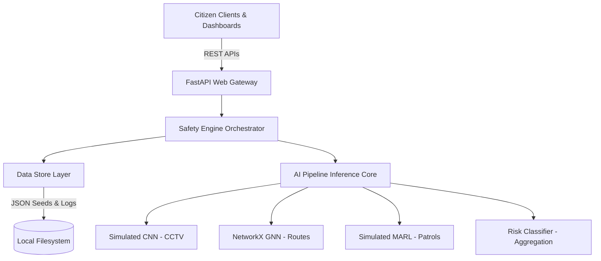
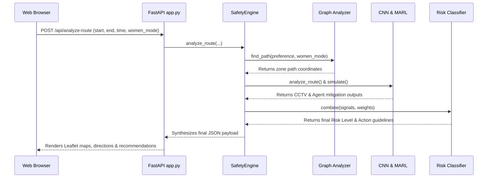

# UrbanShield AI — System Architecture

This document details the backend and frontend architecture of the UrbanShield AI predictive safety intelligence platform.

---

## 1. High-Level System Topology

UrbanShield AI coordinates four model processing layers to synthesize safe transit routes and city safety grids. The architecture is modular, decoupled, and designed to run as a low-latency, lightweight microservice.

---

## 2. Component Design

### 2.1 Backend Core Modules
* **`app.py`**: Web API entry point running FastAPI and Uvicorn. Exposes REST endpoints for route analysis, citizen logs, emergency SOS alerts, and guardian settings.
* **`safety_engine.py`**: Orchestrates calculations between GNN route searches, CCTV telemetry inference, MARL mitigation adjustments, and final weighted risk classifier bands.
* **`data_store.py`**: Simulates atomic file databases using flat JSON files. Seeds default data on first execution and handles concurrent citizen and SOS incident additions safely.

### 2.2 AI Inference Core Modules
* **`gnn_module.py`**: Builds a NetworkX topology graph of city zones and routes. Applies edge penalties (e.g. darkness, isolated stretches) and computes shortest-weighted paths based on safety preference (safest, balanced, fastest).
* **`cnn_module.py`**: Mimics computer vision telemetry processing. Analyzes CCTV feed status (anomaly scores, motion stability, lighting quality) to flag zone hotspots.
* **`marl_simulation.py`**: Models patrol, crowd flow, and security escort agent behaviors. Evaluates how dispatcher placement mitigates transit risk along a route.
* **`risk_classifier.py`**: Conducts mathematical aggregation of CNN, GNN, MARL, and temporal risk indicators to classify transit safety bands (Low, Moderate, High, Critical).

---

## 3. Data Flow Model

---

## 4. REST API Schema

| Method | Endpoint | Description | Payload Schema / Response |
| :--- | :--- | :--- | :--- |
| **GET** | `/api/health` | Health Check | `{"status": "ok", "service": "UrbanShield AI"}` |
| **GET** | `/api/dashboard` | Dashboard Status | Aggregated lists of heatmap zones, SOS alerts, and incident logs. |
| **GET** | `/api/routes` | Grid Connections | Returns all edges, congestion ratings, and base safety config. |
| **GET** | `/api/zones` | Zone Catalog | List of all city zone IDs, coordinates, and options. |
| **POST** | `/api/analyze-route` | Evaluate Path Risk | Injects starting point and preference to generate recommendations. |
| **POST** | `/api/incidents` | Log Community Issue | Citizen report reporting loitering, harassment, infrastructure issues. |
| **POST** | `/api/sos` | Trigger Dispatch Alarm | Initiates simulated responder SMS broadcasts and full-screen visual alarms. |
| **POST** | `/api/guardian/contacts` | Add Contact | Registers primary/secondary SMS contact in database. |
| **DELETE** | `/api/guardian/contacts/{id}` | Delete Contact | Unregisters contact from database. |
